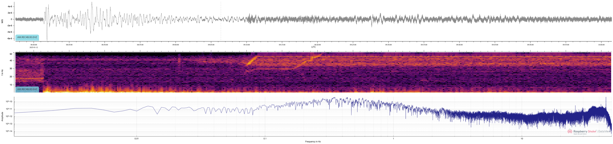
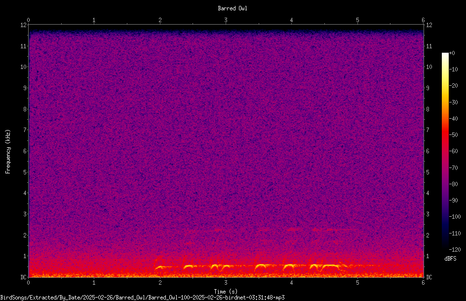
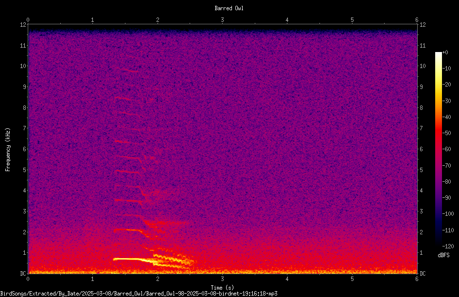
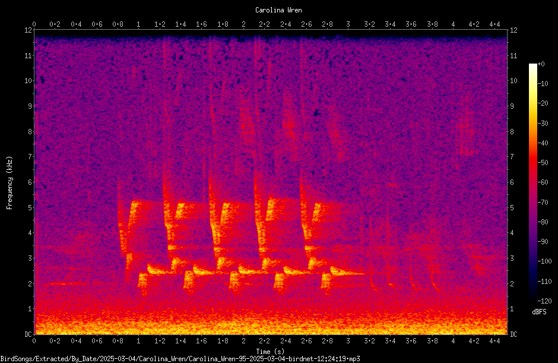
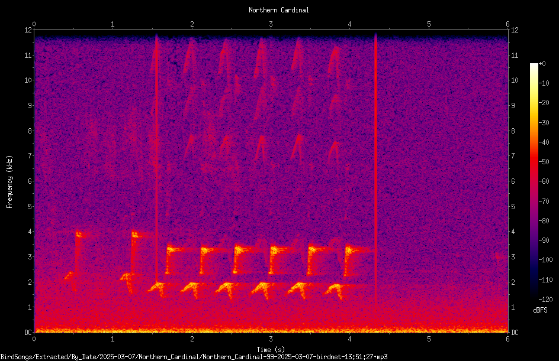
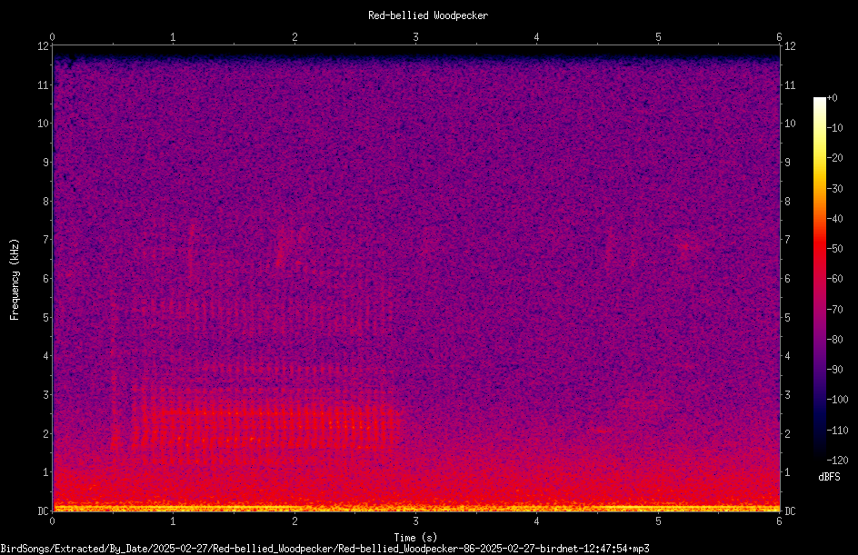
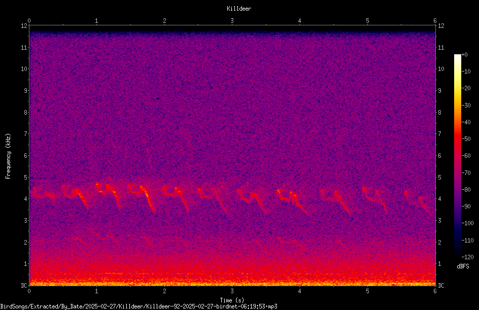

+++
date = '2025-03-11T22:28:13-04:00'
draft = false
title = "Fun With Spectrograms"
+++

In [My First Earthquake]() I briefly mentioned the spectrogram recorded by my Raspberry Shake. Today I want to take a closer look at spectrograms and how to interpret them.
A spectrogram is a visual representation of waves, showing frequencies over time. The image from my Shake shows waves propagating through the Earth, and, if you zoom in on the image from that post, you can see the vertical axis of the spectrogram goes up to 50 Hz:

But the interesting part of that particular recording--the earthquake--consists of frequencies below 10 Hz. Human hearing bottoms out around 20 Hz, so, while we can grok what that image means, it's hard to get a good, intuitive sense of what's going on.

Luckily, I have another Raspberry Pi that runs [Birdnet-Pi](https://github.com/mcguirepr89/BirdNET-Pi) and identifies birds by the sounds they make. Those we *can* hear!
Check this one out--it's from a barred owl, and you can listen as you examine the image:



The first thing to notice is the bright marks at the bottom of the image. Those represent the hooting of the owl. Look at those as you listen. See how the length of each line corresponds to the length of the hoots?
The horizontal axis represents time in seconds, and this entire recording is 6 seconds long. The owl starts just before the 2-second mark, and ends a little before the 5-second mark. (Watch the timer on the audio player, and you should see the same thing.) The vertical axis represents frequency--the owl sounds are around 500 Hz and the top of the chart is 12 kHz, all of which is within the range of typical human hearing. The colors represent the intensity (or loudness) of the sounds, with purples being quieter and oranges and yellows being the loudest. So you can see most of the loudest sounds are in the lower range of this particular chart.

Let's look at another barred owl recording. I like this one because it clearly shows some overtones (the fainter shapes above the brightest mark), as well as the owl's trill in a clear visual form.



Now that you know what you're looking at, here are a few more examples for your enjoyment:

**Carolina wren**



**Northern cardinal**



**Red-bellied woodpecker**



**Killdeer**


