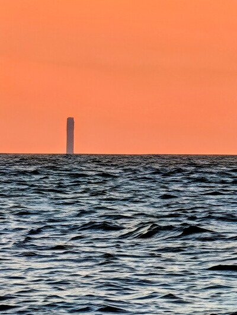

+++
date = '2025-12-05T00:01:53-05:00'
draft = false
title = "Lexical Rogue Waves"
+++

LLMs don't think or reason. They don't have an internal model of the world or abstract representations. Even chain-of-thought is essentially linguistic scaffolding. Set aside for a moment how effective any of these mechanisms are (and they are *extremely* effective) at mimicking thought. Let's just talk about ways we might achieve yet more surprising results. If you see the output of a single LLM as a stream of words, and you squint your eyes and tilt your head, maybe you can imagine some structure or texture. Maybe you can start to see it as a series of waves. And then maybe you can think about introducing another series of waves at an angle. When the two series of waves interact, you'll get a lot of noise. But in the ocean, sometimes waves interact and produce something striking: a rogue wave. We can engineer rogue waves in wave tanks. What if, using LLMs instead of water, we can engineer *lexical rogue waves* that outperform what any of them can do individually?
