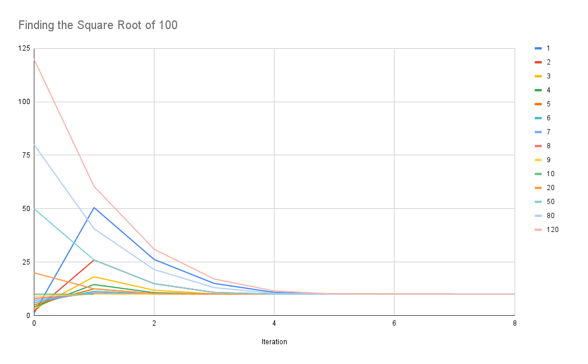

+++
date = '2025-02-01T12:42:13-05:00'
draft = true
title = "Newton's Method"
+++
Want to try something new, make a change, or build a thing? Just
start. It doesn't matter where you start or how much you accomplish on
your first attempt. Take whatever seems to you, in this moment, like a
reasonable first step. That's all. Once you've done that, compare what
you've accomplished to what you're ultimately trying to accomplish,
and take what seems to you, in that moment, like a reasonable second
step. Repeat. Yes, this is massively oversimplified. It doesn't
matter. Just start.

My favorite mental model for this is finding square roots with
[Newton's
Method](https://en.wikipedia.org/wiki/Newton%27s_method). Let's say
you have some number \(x\), and you want to find \(\sqrt{x}\). Do
this:

1. Guess! Pick another number \(y\). Literally any number will do.
2. To check our guess and Determine if \(y = \sqrt{x}\), we have to
see if \(\frac{x}{y} = y\). Because we'll frequently end up with
fractional numbers, we need to replace our concept of "equals" with
"close enough", so let's say if two numbers are within \(0.0000001\),
then they're close enough that we can call them equal. So if
\(\lvert\frac{x}{y} - y\rvert \leq 0.0000001\), then we can claim that
\(y\) is the square root of \(x\).  3. Otherwise, pick a new \(y\) by
finding the midpoint between \(y\) and \(\frac{x}{y}\). Repeat.

Let's take this approach to find the square root of \(100\). So \(x =
100\):

1. We'll arbitrarily choose \(y = 8\).  2. Is \(\frac{100}{8} = 12.5\)
"close enough" to \(8\) to say that \(8 = \sqrt {100}\)?  $$
\begin{aligned} \lvert \frac{x}{y} - y \rvert &= \vert \frac{100}{8} -
8 \rvert \\ &= \lvert 12.5 - 8 \rvert \\ &= 4.5 \end{aligned} $$
3. Nope. \(4.5 > 0.0000001\), so we'll repeat our test with the
midpoint between \(8\) and \(12.5\), \(y = \frac{8 + 12.5}{2} =
10.25\): $$ \begin{aligned} \lvert \frac{x}{y} - y \rvert &= \vert
\frac{100}{10.25} - 10.25 \rvert \\ &= \lvert 9.756097561 - 10.25
\rvert \\ &= 0.493902439 \end{aligned} $$ 3. We've made progress!
\(0.493902439 > 0.0000001\), but it's a lot smaller than \(4.5\), so
this guess is closer to being the square root of 100.  4. We'll need
to repeat this process twice more, with guesses of \(10.00304878\) and
\(10.00000046\), and then we can say we found our answer.

We found the square root of 100 in 4 steps (\(8, 10.25, 10.00304878,
10.00000046\)), but we also started kinda close to the actual square
root. How much does that first guess matter, and how many more steps
might it have taken if we started with a bad guess? Here's a chart
showing initial guesses ranging from 1 to 120, and all of them
converge to "close enough to 10" in 8 steps or less (the horizontal
axis shows the iteration number, and the vertical axis shows the value
of the guess):

Try it yourself: no matter where you start, this procedure will
*always* converge to the square root.

This is how I motivate myself when I'm starting something new (like, 
say, a blog) and I don't have a good understanding of how to
proceed. It doesn't matter where you start, so just start.
